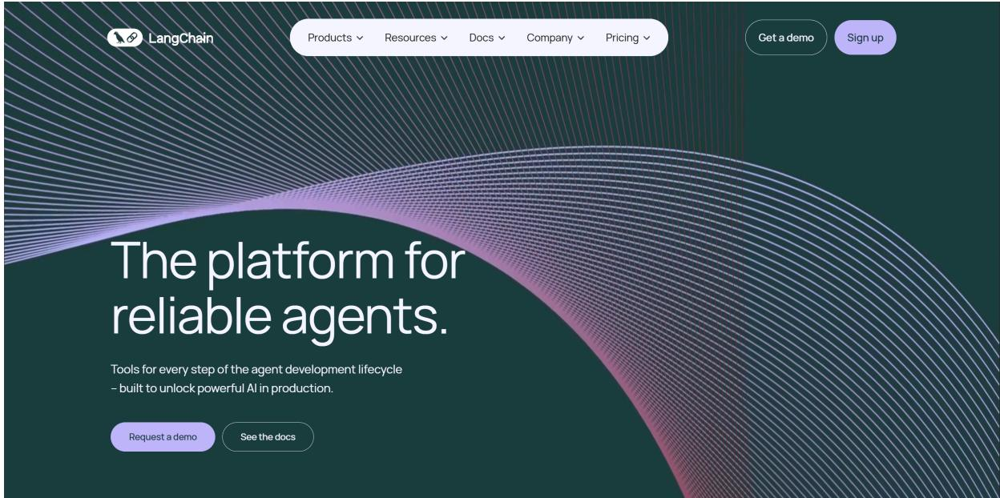
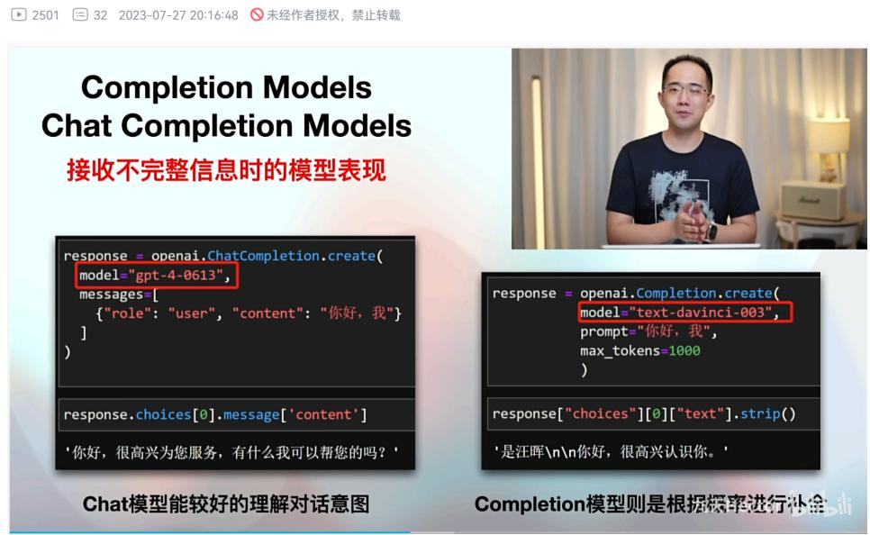
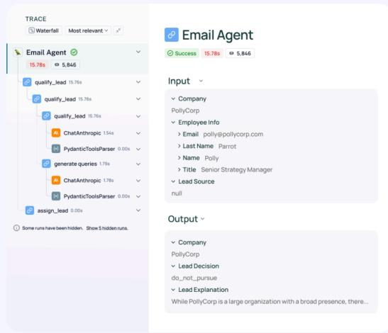
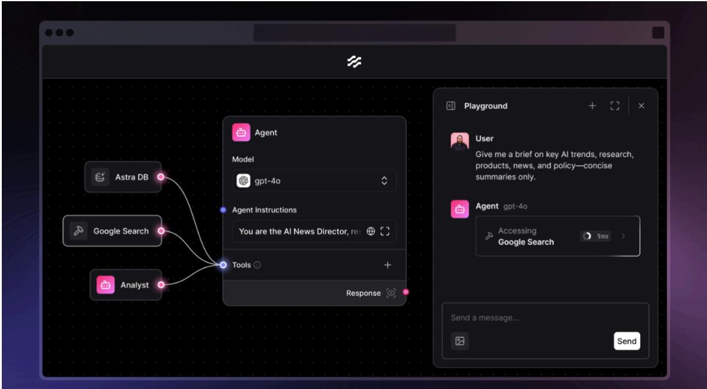
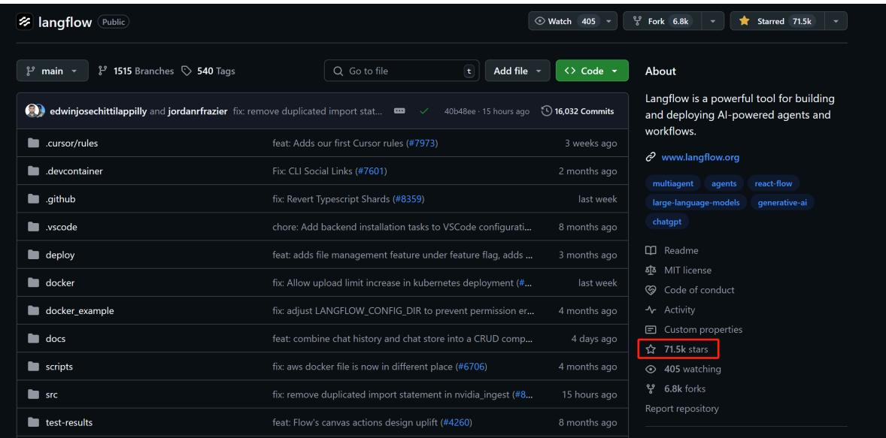
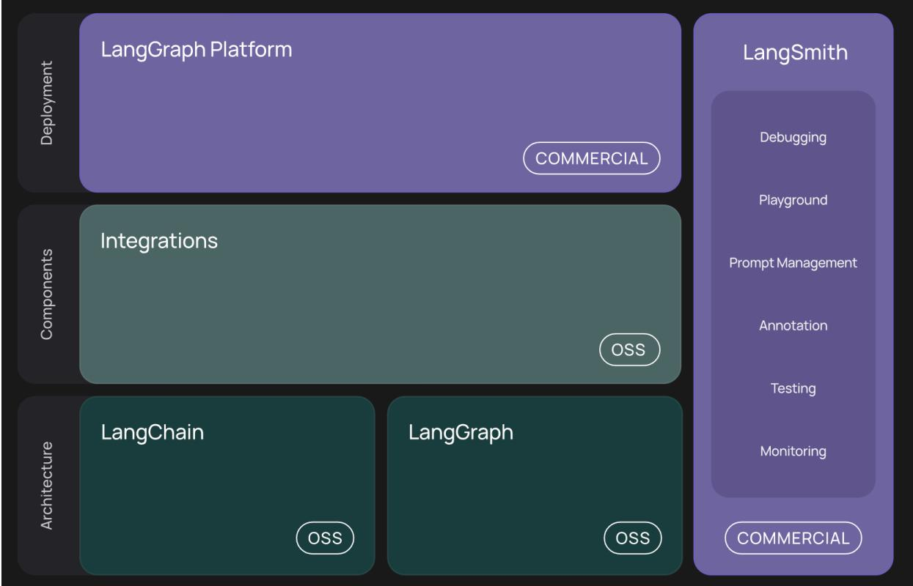
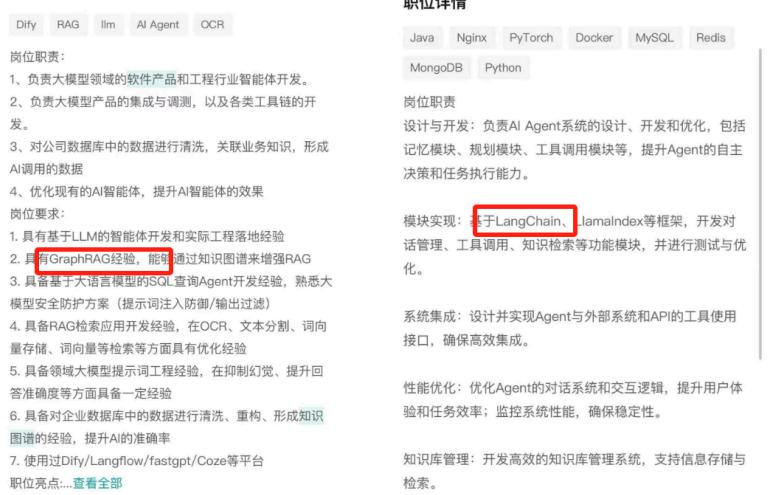
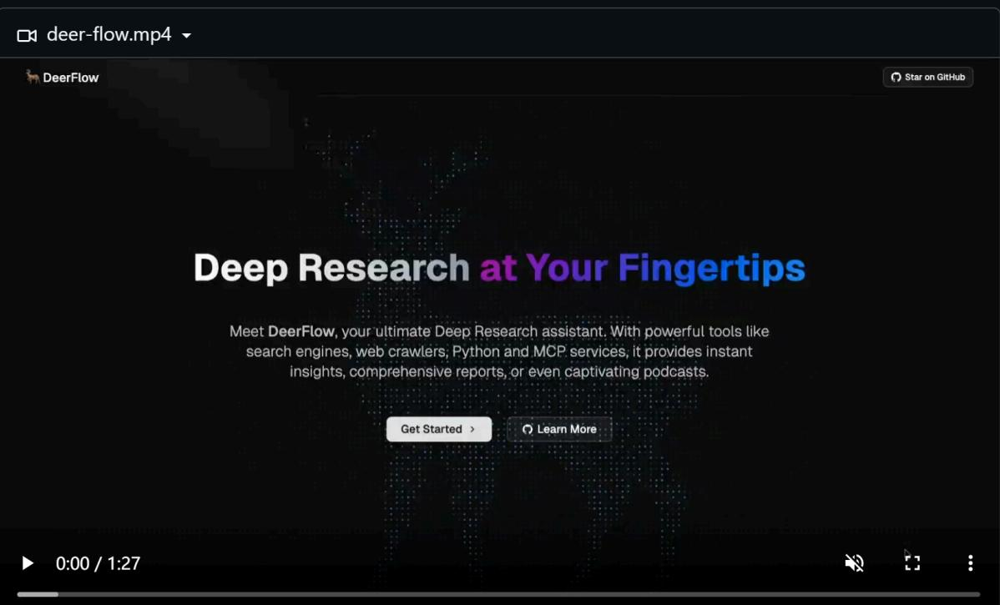
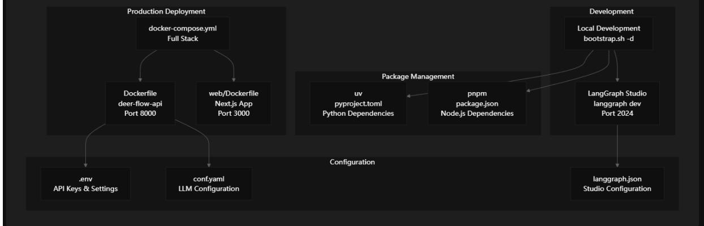
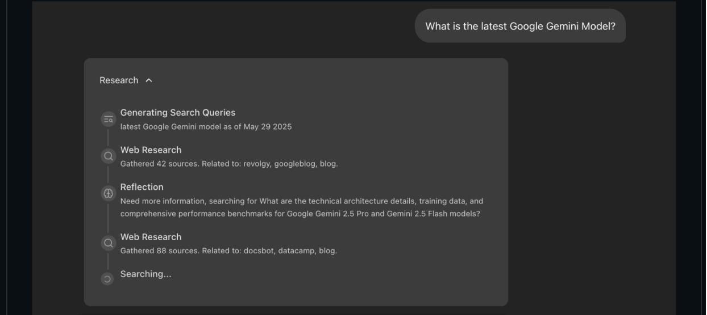

# LangChain快速入门与Agent开发实战-Part 1

# 一、LangChain.ai工具生态介绍

本期公开课，我将为大家详细讲解元老级Agent开发工具——LangChain。

# 1. GPT-3时代下第一代大模型开发工具

LangChain可以称之为自2022年底大模型技术爆火以来的第一个真正意义上的大模型开发框架。大模型本质上无法直接解决实际的问题，仅仅是一个能够分析、推理和生成文本的黑盒。直到现在，所有的开发者们仍然在不断探索如何把大模型的强大能力与实际应用场景结合起来，而当时 LangChain 的出现，直接让大模型开发变得简单起来，它将大模型开发过程中常用的功能、工具、流程等等全部封装成一个个的组件，使开发者可以像搭乐高积木一样，快速的组合出适用于不同场景需求的大模型应用。

LangChain的首个版本于2022年10月开源，直到现在仍然再以一个飞快的速度不断进行迭代升级。从一个开源 Python/TS 框架逐渐发展，形成包括“链”和“代理”等核心组件，现在已走向企业级阶段，发展成了LangChain AI，其拥有目前Agent技术领域最大的开源生态，衍生出了多个开源项目框架，各自都在大模型的技术领域承担着不同的开发任务角色。

从一个形象的角度来说，LangChain的功能定位其实并不是我们现在所谓的Agent开发框架，而是一个大模型功能增强器，借助LangChain，哪怕在GPT-3模型时代，也能让模型完成对话、拥有记忆、甚至是完成结构化输出等功能。

LangChain官网：https://www.langchain.com/

# 2. 备受争议的工具功能

虽说LangChain的开源，在短时间内收获了大量的开发者用户，这也一度使得LangChain在2023年成为最受欢迎的大模型开发工具没有之一。但每项技术都会受限于其诞生的时代背景，LangChain也不例外。在GPT-3时代，大模型以补全模型为主，只能以类似“成语接龙”的方式对文本进行补全，并且实际运行效果也非常不稳定。此时LangChain借助一些高层封装的API，能够让模型完成对话、调用外部工具、甚至是结构化输出等功能，这在当时是非常大的进步，也为开发者提供了极大的便利。

但是，伴随着GPT-3.5模型的发布，对话模型正式登上历史的舞台，并逐渐成为主流。而得益于对话模型更强的指令跟随能力，很多GPT-3需要借助LangChain才能完成的工作，已经成为GPT-3.5原生自带的一些功能。而等到GPT-4逐渐普及，包括调用外部工具（Function calling）、结构化输出、系统提示词等功能，都成了模型的基础功能。而对于开发者而言，此时再使用LangChain再对这些功能进行封装就显得多此一举。

GPT大模型技术实战教程07:GPT最新Chat类模型入门介绍【考古】补全模型与对话模型对比介绍：https://www.bilibili.com/video/BV1Vk4y1V76h

因此在2023年下半年起的很长一段时间里，LangChain饱受争议，很多开发者觉得LangChain代码冗余、编写复杂，甚至有开发者觉得LangChain太过于复杂，一个模型调用的过程就涉及到数十个类，一个项目开发动辄就要用到几十个不同的类，而说明文档更是几百个不同的常用类需要记住，其复杂程度不亚于学习一门全新的编程语言。

# 1."太臃肿，依赖太多，维护复杂"

来自 Reddit上一条热门讨论：

"The framework feels bloated, with too many dependencies and unnecessary complexity." reddit.com +6 reddit.com

其他评论也指出:

"t's unstable, the interface constantly changes, the documentation is regularly out of date, and the abstractions are overly complicated." redit.com

一位用户总结：

"LangChain has a reputation for getting in the way and not actually making your code more efficient ..It is my own framework, but it is extremely, extremely lightweight, developer-centric and transparent." reddit.com +8

# 2."抽象混乱、名称不一致，调试困难"

另一条 Reddit日志中，有开发者直言道：

"LangChain is arguably the worst library that l've ever worked in my life. Inconsistent abstractions, inconsistent naming schemas, inconsistent behaviour, confusing error management .." reddit.com

社区中也出现了类似评价：

"..unnecessary complexity creates a tribalism which hurts the up-and-coming Al ecosystem... Debugging a LangChain error is near impossible, even with verbose=True."

# 3."文档混乱、更新跟不上代码'

不少用户在 GitHub Issue 和 Reddit 反馈:

"文档已经重写3次，太让人抓狂"  
“官方文档太糟糕，不详细，不一致" reddit.com +8  
关于语法变化频繁、verbose 输出失效等问题：有人发布 Issue 报告verbose 行为不一致，Issue 团队关闭但没给明确解决方案，导致信任下降。

而这也使得在某个时间段，LangChain的开发者大规模流失。

举个例子，为了更好的兼容不同模型的调用，谷歌ADK采用了LiteLlm作为底层模型调度框架，一个库即可调用各类模型，而LangChain则为每个主流模型单独封装了一个库，调用不同模型的时候需要导入不同模型对应的库，例如调用DeepSeek就需要安装 langchain-deepseek ，而调用Gemini则需要安装 langchain-google-genai 。

# 3. 更加适用于当前Agent开发的LangChain工具生态

在经历了短暂的阵痛后，LangChain果断进行了大刀阔斧的改革。LangChain调整的思路非常简单：

1. LangChain本身仍然坚守作为“模型能力增强器”的功能定位，并且逐渐稳定更新节奏和频率，虽说实际使用LangChain进行开发的代码量仍然没变，但模块划分更加清晰、功能更加丰富和稳定，逐步达到企业级应用水准。目前最新版LangChain的核心功能如下：

<table><tr><td rowspan=1 colspan=1>模块类别</td><td rowspan=1 colspan=1>示例功能</td></tr><tr><td rowspan=1 colspan=1>模型接口封装</td><td rowspan=1 colspan=1>OpenAl、Claude、Cohere、Qwen 等模型统一调用方式</td></tr><tr><td rowspan=1 colspan=1>输出结构化</td><td rowspan=1 colspan=1>自动从模型中解析JSON、SSchema、函数签名、文档等</td></tr><tr><td rowspan=1 colspan=1>Memory管理</td><td rowspan=1 colspan=1>Buffer、Summary、Entity、(Conversation Memory等</td></tr><tr><td rowspan=1 colspan=1>Tool接入</td><td rowspan=1 colspan=1>Web 搜索、SQL数据库、Python 执行器、API代理等</td></tr><tr><td rowspan=1 colspan=1>Agent架构</td><td rowspan=1 colspan=1>ReAct、Self-Ask、OpenAl Function Agent 等调度机制</td></tr><tr><td rowspan=1 colspan=1>RAG集成</td><td rowspan=1 colspan=1>多种 Retriever、Vector Store、文档拆分策略</td></tr><tr><td rowspan=1 colspan=1>Server/API发布</td><td rowspan=1 colspan=1>快速将链部署为Web 服务或 A2A Agent</td></tr><tr><td rowspan=1 colspan=1>Debug &amp; Callback</td><td rowspan=1 colspan=1>Token 使用统计、LangSmith可视化追踪等</td></tr></table>

✅ 所以说：LangChain 是 LLM 功能开发的「积木工厂」，不是简单框架，而是模型增强器$^ +$ 应用组装工具箱。

2. 与2023年下半年开源LangGraph，LangGraph作为基于LangChain的更高层次封装，能够更加便捷的搭建图结构的大模型工作流，也就是现在所谓的Multi-Agent系统，而LangGraph也是目前LangChian家族最核心的Multi-Agent开发框架。同时可以搭配LangGraph-Studio进行实时效果监测，实际效果如下所示：

# LangGraph

Trusted by companies shaping the future of agents -including Klarna, Replit, Elastic,and more-LangGraph is a low-level orchestration framework for building, managing, and deploying long-running, stateful agents.

项目官网：https://github.com/langchain-ai/langgraph

需要注意的是，LangGraph底层功能仍然是基于LangChain来实现，简单理解LangGraph本质上其实就是LangChain的流程调度与智能体编排系统

3. 开源大模型工作流（Agent）可视化监控与测试平台LangSmith，借助LangSmith，开发者能够更加简单便捷监控基于LangChain生态的Agent运行流程、测试Agent功能和不同提示词等，从而使得LangChain进一步面向企业级应用开发框架；

# Find failures fast with agent observability.

Quickly debug and understand non-deterministic LLMapp behavior with tracing.See what your agentis doing step by step -then fix issues to improve latency and response quality.

Get started tracing your app 7

LangSmith官网：https://www.langchain.com/langsmith

4. 同时，考虑到LangChain本身较为复杂这一情况，开源了LangChain的“可视化实现版”——LangFlow，这是一款形式对标Dify、可以通过可视化方式、借助拖拉拽来完成LangChain相同功能的开发工具。

同时，这也是目前LangChain工具家族中，仅次于LangChain（109k stars）第二受欢迎的开发框架，在GitHub上已斩获接近72k stars。

LangFlow官网：https://www.langflow.org/

同时，相比Dify，LangFlow功能更加完善，并且没有任何商业化的计划，可长期稳定使用。目前LangChain工具生态如图所示：

此外，作为底层框架本身，LangChain本身仍保持了非常快速的迭代速度，例如就在5月29号，LangChain发布最新版本，新增了目前通用智能体项目非常需要的沙盒环境（SandBox）：

● LANGCHAIN

# LangChain Sandbox: Run untrusted Python in your Al Agents

LangChain Sandbox lets you safely run untrusted Python in your Al agents! Built on Pyodide (Python in WebAssembly), LangChain Sandbox lets you execute code securely:

Isolated runtime with configurable permissions No Docker or remote code execution required Supports session-based state persistence

Check out the examples (open-source): https://github.com/langchain-ai/langchain-sandbox/tree/main/examples

同时，LangChain也是最早官宣支持谷歌A2A技术协议的开发框架，这也使得LangChain本身的先进性一直处于整个Agent开发框架的前列。

# 4. 当下大模型开发人员必备技能：LangChain

可以说，经过了近3年的发展，目前LangChain工具生态已经非常全面，能适用于各类不同场景的开发需求，无论是小规模实验、还是大规模商业化部署，无论是使用代码开发、还是偏向使用低代码开发工具，LangChain工具家族都能满足开发者的需求。

也正因如此，LangChain可以说是历经大模型Agent技术发展巨变但仍“屹立不倒”的开发工具，哪怕今年以来OpenAI、谷歌等AI巨头纷纷下场发布全新一代Agent开发框架，但LangChian工具本身仍在很多场景下不可替代。而相比之下，类似AotuGen、CrewAI等工具的适用面，在大模型技术飞速发展的当下，正在逐渐减少。截止目前，LangChain仍然是目前大模型开发岗位应用最广的框架没有之一：

# 职位详情

# 职位详情

# 职位详情

<table><tr><td>Redis</td><td>Numpy</td><td>爬虫经验 微服务经验 Django</td></tr><tr><td>Pandas</td><td>MySQL 运维开发经验</td><td>Tornado Oracle</td></tr><tr><td>Linux开发/部署经验</td><td colspan="2">Python Flask</td></tr><tr><td colspan="4">1.基于谷歌、微软、openAI、百度、腾讯、阿里、字节等头</td></tr><tr><td colspan="4">部公司的开源项目基础上进行AIAgent应用研发；</td></tr><tr><td colspan="4">2.负责多AI智能体群协同应用研发；</td></tr><tr><td colspan="4">3.负责多模态RAG精准知识抽取算法设计；</td></tr><tr><td colspan="4">4.负责多AlAgent协同自进化系统的结构设计与优化；</td></tr><tr><td colspan="4">5.针对垂直领域做细分场景下的多智能体构建与验证优化</td></tr><tr><td colspan="4">6.负责参与设计和验证具有自进化强化学习能力的智能体</td></tr><tr><td colspan="4">结构；</td></tr><tr><td colspan="4">任职要求：</td></tr><tr><td colspan="4">1、掌握语言python，计算机/数学/物理相关专业 2、熟练掌握Autogen/Anda、OpenSPG/RAGFlow、</td></tr></table>

# LangGraph;

3、对复杂动态博弈环境下多智能体协同控制与决策有一定学习研究基础；

同时LangChain也是很多著名的开源项目的底层开发框架，如字节前端时间开源的Deep Research应用deerflow就是采用了LangChain&LangGraph框架：

项目主页：https://github.com/bytedance/deer-flow

此外如谷歌近期开源的Gemini Fullstack LangGraph Quickstart热门项目，也是使用LangGraph作为基础框架：

# Gemini Fullstack LangGraph Quickstart

This project demonstrates a fulstack application using a React frontend and a LangGraph-powered backend agent. The agent is designed to perform comprehensive research on a user's query by dynamically generating search terms, querying the web using Google Search, reflecting on the results to identify knowledge gaps,and iteratively refining its search until it can provide a wel-supported answer with citations.This application serves as an example of building research-augmented conversational Al using LangGraph and Google's Gemini models.

项目主页：https://github.com/google-gemini/gemini-fullstack-langgraph-quickstart